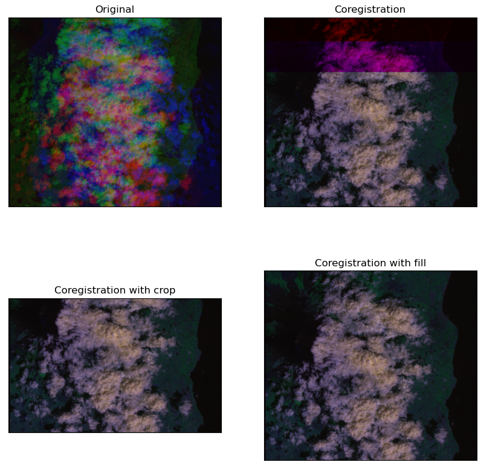

# Documentation

<!-- TABLE OF CONTENTS -->
<details open="open">
  <summary>Table of Contents</summary>
  <ol>
    <li><a href="#about-the-project">About the Project</a></li>
    <li><a href="#content-of-the-repository">Content of the repository</a></li>
    <li><a href="#installation">Installation</a>
    <ul>
      <li><a href="#create-the-PyRawS-environment">Create the PyRawS environment</a></li>
      <li><a href="#set-up-for-coregistration-study">Set-up-for-coregistration-study</a></li>
      <li><a href="#data-directory">Data directory</a></li>
    </ul>
    <li><a href="#PyRawS-databases">PyRawS databases</a></li>
    <li><a href="#raw-events-and-raw-granules">Raw events and Raw granules</a></li>
    <li><a href="#quickstart">Quickstart</a>
      <ul>
      <li><a href="#open-a-raw-event-from-path">Open a Raw event from PATH.</a></li>
      <li><a href="#open-a-raw-event-from-database">Open a Raw event from database.</a></li>
      <li><a href="#show-raw-granules-information-of-a-raw-event">Show Raw granules information of a Raw event</a></li>
      <li><a href="#access-a-rawgranule-pixels">Access a Raw_granule pixels</a></li>
      <li><a href="#get-a-single-rawgranule-from-a-rawevent">Get a single Raw_granule from a Raw_event</a></li>
      <li><a href="#superimpose-rawgranule-bands">Superimpose Raw_granule bands</a></li>
      <li><a href="#how-to-perform-the-coarse-coregisteration-of-rawgranules">How to perform the coarse coregisteration of Raw_granules</a></li>
      <li><a href="#how-to-get-coordinates-of-a-raw-granule-band">How to get the coordinates of a Raw granule band</a></li>
      <li><a href="#rawevent-database-metadata">Raw_event: database metadata</a></li>
      <li><a href="#export-a-rawgranule-to-tif">Export a Raw_granule to TIF</a></li>
      </ul>
    </li>
    <li><a href="#glossary">Glossary</a></li>
    <li><a href="#contributing">Contributing</a></li>
    <li><a href="#license">License</a></li>
    <li><a href="#contacts">Contacts</a></li>
  </ol>
</details>


## Content of the repository
The PyRawS repository includes the following directories:


* **quickstart**: it contains some subdirectories including [jupyter notebooks](https://jupyter-notebook.readthedocs.io/en/stable/index.html):
  1. `API demonstration`: it contains a notebook to demonstrate PyRawS API.
  2. `DB_creation`: it contains a notebook to automatically create a database for a target dataset.
  3. `geographical_distribution`: it contains a notebook to diplay the geographical distribution of the events of a dataset into a map.

* **PyRawS**: it contains the PyRawS package. The latter is made of the following subdirectories:
  1. `database`: it contains various [PyRawS database](#PyRawS-databases) and other databases.
  2. `raw`: it includes the `Raw_event` and `Raw_granule` classes used to model, respectively, [Sentinel-2 Raw events](#sentinel-2-raw-event) and [Sentinel-2 Raw granules](#sentinel-2-raw-granule).
  3. `l1`: it contains the `L1_event` and `L1_tiles` classes used to model, respectively, [Sentinel-2 L1C events](#sentinel-2-l1c-event) and [Sentinel-2 L1C tiles](#sentinel-2-l1c-tile).
  4. `utils`: it contains some utilities for the PYRAW package.

* **resources**: it contains various resources (i.e., images for the README)
* **scripts_and_studies**: it contains various scripts and code for different studies realized to create the `THRAWS` dataset. In particular:
  1. `coregistration_study`: it contains utils used to perform the coregistration study and desing the [coarse coregistration](#coarse-coregistration) technique.
  2. `dataset_preparation`: it contains scripts and other files used to design the `THRAWS` files (i.e., download data, select events, and others).
  3. `hta_detection_algorithms`: it contains custom and simplified implementation of various high-thermal-anomalies-dection algorithms, including [1](#ref1) used to design the `THRAWS` dataset.
  4. `runscripts`: it contains some runscripts and utils to crop [Sentinel-2 L1C tiles](#sentinel-2-l1c-tile) and generate useful images and export tif.
  5. `granules_filtering`: it contains a script to run and [[1]](#ref1) on [cropped Sentinel-2 L1-C tiles](#sentinel-2-l1c-tile), extract bounding boxes and map them to the correspondent [Raw granules](#sentinel-2-raw-granule).
  6. `download_thraws`: it contains the utility for the download of the dataset [THRAWS](https://zenodo.org/record/7908728).


## Installation
### Pre-requirements
Before all, clone this repository. We suggest using git from CLI, execute:

``` git clone https://github.com/ESA-PhiLab/PyRawS ```


### Create the PyRawS environment
#### - On Linux
```
# For Linux, the installation is straightforward. 
# You just need to run the following command from the main directory:

\bin\bash\ source pyraws_install.sh

# NB: Your data should be placed in the data directory in the main.
```

#### - On Other Os
```
# To install the environment, we suggest to use anaconda. 
# You can create a dedicated conda environment by using the `environment.yml` file by running the following command from the main directory: 

conda env create -f environment.yml 

# To activate your environment, please execute:

conda activate PyRawS

```

Create a file `sys_cfg.py` in the directory `pyraws\pyraws`, and add two variables as follows:

``` PYRAWS_HOME_PATH="Absolute path to the main pyraws directory.```

``` DATA_PATH="Absolute path to the data directory. " ```

By default the data directory is located in PyRawS main directory.

<!-- You can also install  `pyraws` [PyPy](https://www.pypy.org/) by running the following command from the main:

``` pip install pyraws ``` -->
### Docker

To use PyRawS with docker, use one of the following methods.


#### Method 1: Pull the docker image from Docker Hub

``` docker pull sirbastiano94/pyraws:latest ```

#### Method 2: Build docker image

Follow these steps:

1. Clone the repository and build the docker image by running the following command from the main directory:

``` docker build -t pyraws:latest  --build-arg CACHEBUST=$(date +%s) -f dockerfile . ```

2. Run the docker image by executing:

``` docker run -it --rm -p 8888:8888 pyraws:latest ```


### Set-up for coregistration study

If you want to perform the coregistration study, you need to:

* clone the repository [SuperGlue Inference and Evaluation Demo Script](https://github.com/magicleap/SuperGluePretrainedNetwork);
* rename the subdirectory `models` to `superglue_models`;
* move `superglue_models` into `coregistration_study`.

Coregistration study results can be generated by using the `pyraws_coregistration_study.ipynb` notebook. The database `coregistration_study_db.csv` containing info on the discarded eruption events is used to generate results in the notebook.

Coregistration notebook results can be generated by using the `pyraws_coregistration_profiling.ipynb` notebook.

### Data directory

All the data used by PyRawS need to be located in a directory called `data`, containing all the different datasets. You can place the `data` directory where you want and  update the `DATA_PATH` variable in the `sys_cfg.py` file with its path (please, refer to: [Set-up for coregistration study](#set-up-for-coregistration-study)). 
By default the data directory is located in PyRawS main directory.
<br>
To create a specific dataset, you need to create subfolder with the dataset name (e.g., `THRAWS`) in the `data` directory specific for your dataset. Such directory shall contain the following subdirectories:

* `raw`: it will contain [decompressed raw](#sentinel-2-raw-data).
* `l1c`: it will contain [L1C](#sentinel-2-l1c-data).

Every [raw data](#sentinel-2-decompressed-raw-data) and [L1C](#sentinel-2-l1c-data) data shall be contained in a specific subdirectory --placed in `raw`or `l1c`-- whose name shall match one of the **ID_event** entries of the **.csv** file, located in `database` directory.

## PyRawS databases

To create the "THRAWS" database, the user should refer to the notebook called "database_creation.ipynb". This notebook contains the necessary code and instructions for creating the database. Simply follow the steps outlined in the notebook to successfully create the "THRAWS" database.

Please note that it is important to carefully follow the instructions in the notebook to ensure that the database is created correctly and without errors. Additionally, make sure that all required dependencies and packages are installed before running the code in the notebook.

 <!-- Leave two free lines below -->


This respository contains an example of database (`THRAWS`) that is used by PyRawS to read and process [Sentinel-2 Raw data](#sentinel-2-raw-data) and [Sentinel-2 L1 data](#sentinel-2-l1-data) correctly. The minimal fields of the database include:

* **ID_event**:	ID of the event (e.g., volcanic-eruption, wildfire, not-event). All the other fields of the row are referred to that `Sentinel-2` acquisition.
* **class**:	class of the event (e.g., eruption, fire, not-event). Leave it **empty**
* **Raw_useful_granules**:		list of [Raw useful granules](#raw-useful-granule). Set to `None` or leave it empty if you do not know what are the [Raw useful granules](#raw-useful-granule).
* **Raw_complementary_granules**:	list of [Raw complementry granules](#raw-complementary-granule). Set to `None` or leave it empty if you do not know what are the [Raw complementry granules](#raw-complementary-granule).
* **Raw_files**:	list of [Raw granules](#sentinel-2-raw-granule) (**mandatory**).
* **l1c_files**: list of [L1 tiles](#sentinel-2-l1c-tile) (mandatory if you need L1C data).
* **bbox_list**:	dictionary {[Raw useful granules](#raw-useful-granule) : [bounding box list for that granule]}.  Set to `None` or leave it **empty** if you do not know the bounding box location.

To create a new database (e.g., `my_database_name`), please, proceed as follows:

1. Create a ".csv" file with the structure shown above and place it into the `database`subfloders (e.g., `my_db.csv`). You can use start from the [thraws_db.csv](https://github.com/ESA-PhiLab/PyRawS/-/blob/main/PyRawS/database/thraws_db.csv) database and edit it accordingly to your specification.
2. Create subdirectory `my_database_name` in the `data` subdirectory and populate it with the correspondent [Sentinel-2 Raw data](#sentinel-2-raw-data) and [Sentinel-2 L1 data](#sentinel-2-l1-data) as described in [Data directory](#data-directory).
3. Update the `DATABASE_FILE_DICTIONARY` in `PyRawS/utils/constants.py` as follows:

```DATABASE_FILE_DICTIONARY={"THRAWS" : "thraws_db.csv", "my_database_name" : "my_db.csv"}```

Now, you should be able to use your new database. <br>
**N.B** The creation of a database is not mandatory. However, it is strongly advisable. Indeed, without creating a database you can still open `Raw data` as described in [Open a Raw event from path](#open-a-raw-event-from-path). However, some pieces of information such as the [Raw useful granules](#raw-useful-granule) associated to a specific event, the event bounding boxes or the image class can be retrieved only when the database is set-up.

## Raw events and Raw granules


Downloading [Sentinel-2 Raw data](#sentinel-2-raw-data) requires to specify a polygon surrounding the area of interest and a date. Given the pushbroom nature of the [Sentinel-2](https://sentinel.esa.int/documents/247904/685211/sentinel-2-products-specification-document) sensor, bands of data at  [Raw](#sentinel-2-raw-data) level do not look at the same area (i.e., they are not registered). Therefore,to be sure to collect all the band around an event (i.e., volcanic eruptions, wildfires) rectangular polygons centered on the events of area 28x10 $km^2$ are used (white rectangular in the image above). This leads to download all the [Raw granules](#sentinel-2-raw-granule) whose reference band (`B02`) interesects the polygon area. <br> The image above shows the footprint of the all the [Sentinel-2 Raw granules](#sentinel-2-raw-granule) that are downloaded for the eruption named "`Etna_00`" in our database by using the white rectangular polygon. We define the collection of [Raw granules](#sentinel-2-raw-granule) that are downloaded for each of the rows of our database "[Sentinel-2 Raw event](#Sentinel-2-RAW-event)". <br> However, as you can see in the image above, most of the [Sentinel-2 Raw granules](#sentinel-2-raw-granule) in `Etna_00` [Sentinel-2 Raw event](#Sentinel-2-RAW-event) do not contain the volcanic eruption (big red spot) of interest (red rectangulars). Indeed, only the yellow and the pink rectangulars intersects or include part of the volcanic eruption. <br> In addition, the fact that one [Raw granule](#sentinel-2-raw-granule) intersects or include one event, this does not mean that the latter interesects or is included in all the bands of that [Raw granule](#sentinel-2-raw-granule). In particular,
since we use the bands [`B8A`, `B11`, `B12`] to detect wildfires and volcanic eruptions, we consider [Raw useful granules](#raw-useful-granule) those granules whose band `B8A` interesects the event. This is true for the yellow rectangular but not for the pink one (you need to trust us here, since the bands are not displaced in the image above).  We take the band `B8A` only because after the coregistration, the other bands will be moved to match the area of `B8A`.<br>
Finally, for some [Raw useful granules](#raw-useful-granule) part of the eruptions or the wildfire could extend until the top or the bottom edge of the polygon. In this case, some of the bands could be missing for a portion of the area of interest. To be sure that this is not happening, in addition to the [Raw useful granules](#raw-useful-granule), it is important to consider [Raw complementary granules](#raw-complementary-granule), which fills the missing part of the interest bands of the [Raw useful granules](#raw-useful-granule). <br> For each [Sentinel-2 Raw event](#Sentinel-2-RAW-event), the `THRAWS` dataset clearly states those [Raw granules](#sentinel-2-raw-granule) that are [Raw useful granules](#raw-useful-granule) or [Raw complementary granules](#raw-complementary-granule). However, the entire [Raw granules](#sentinel-2-raw-granule) collection is provided for each [Raw event](#sentinel-2-raw-event) to permit users that wants to use other bands to detect warm temeprature anomalies to do it.


## Quickstart
The next examples (with the exception of [Open a Raw event from path](#open-a-raw-event-from-path)) will exploit the `THRAWS` database to showcase the use of PyRawS, but they are applicable to any [databases compatible with PyRawS](#PyRawS-databases).

### Open a Raw event from path
The next code snipped will showcase how to use PyRawS to open a [Raw_event](#sentinel-2-raw-event) `My_Raw_data`, included in the `THRAWS` database by using its `PATH`. We assume to have the `My_RAW_data` directory in the same directory where you execute the code snippet below. <br>
To manipulate [Raw events](#sentinel-2-raw-event), `PyRawS` offer a class called `Raw_event`. To open an avent, we will use the [Raw_event](#sentinel-2-raw-event) class method `from_path(...)`, which parses the database specified, retrieves the event specified by `id_event` and opens it with the requested bands (`bands_list`).
When you open an event, you can specify which bands to use. If `bands_list` is not specified, the method `from_path(...)` will return all the bands.

```py
from pyraws.raw.raw_event import Raw_event
#Instantiate an empty Raw_event
raw_event=Raw_event()

#Bands to open.
bands_list=["B8A", "B11", "B12"]

#Read "Etna_00"  from THRAWS
raw_event.from_path(#Path to the Etna_00 event
                    raw_dir_path="Path_to_my_RAW_data",
                    #Bands to open. Leave to None to use all the bands.
                    bands_list=bands_list,
                    #If True, verbose mode is on.
                    verbose=True)
```
The example above can be used directly, **even if you did not set up a** [PyRawS database](#PyRawS-databases). However, `PyRawS` offer some API to parse directly [Raw_event](#sentinel-2-raw-event) parsing a database. with no need to specify a path. Please, check [Open a Raw event from database](#open-a-raw-event-from-database).

### Open a Raw event from database
The next code snipped will showcase how to use PyRawS to open the [Raw_event](#sentinel-2-raw-event) `Etna_00` included in the `THRAWS` database. <br> To do that,
To manipulate [Raw events](#sentinel-2-raw-event) objects, `PyRawS` will exploits the `Raw_event` class method `from_database(...)`, which parses the associated `.csv` file located in `PyRawS/database` with no need to specify the `PATH` from the user. To execute the next code snipped, we assume to you have already downloaded and set-up the `THRAWS` database as specificied in [databases compatible with PyRawS](#PyRawS-databases).
As for the method `from_path(...)` described in [Open a Raw event from path](#open-an-raw-event-from-path), you can specify which bands to use. If `bands_list` is not specified, the method `from_database(...)` will return all the bands.

```py
from pyraws.raw.raw_event import Raw_event
#Instantiate an empty Raw_event
raw_event=Raw_event()

#Bands to open.
bands_list=["B8A", "B11", "B12"]

#Read "Etna_00"  from THRAWS
raw_event.from_database(#Database ID_EVENT
                      id_event="Etna_00",
                      #Bands to open. Leave to None to use all the bands.
                      bands_list=bands_list,
                      #If True, verbose mode is on.
                      verbose=True,
                      #Database name
                      database="THRAWS")
```
All the next examples will assume you already have downloaded and set-up the `THRAWS` database as specificied in [databases compatible with PyRawS](#PyRawS-databases). However, they can work by using `from_path(...)` instead of `from_database(...)` and specifying the `PATH` to the `Etna_00` event manually.

### Show Raw granules information of a Raw event
As specified in [Raw events and Raw granules](#raw-events-and-raw-granules), an [Raw event](#sentinel-2-raw-event) is a collection of [Raw granules](#sentinel-2-raw-granule). As for [Raw_event](#sentinel-2-raw-event), [Raw granules](#sentinel-2-raw-granule) are modelled in PyRawS through a dedicated class `Raw_granule`.  <br>
The next code snippet will show how to get the information about the [Raw granules](#sentinel-2-raw-granule) that compose the `Etna_00` [Raw_event](#sentinel-2-raw-event). The class method `show_granules_info()` will print the list of events and some metada for each event. To get the same information as a dictionary `{granule name : granule info}` for an easy manipulation, you can use the `Raw_event` class method `get_granules_info(...)`.

```py
from pyraws.raw.raw_event import Raw_event
#Instantiate an empty Raw_event
raw_event=Raw_event()

#Bands to open.
bands_list=["B8A", "B11", "B12"]

#Read "Etna_00" from THRAWS database.
#You can also read it by using raw_event.from_path(...).
raw_event.from_database( #Database ID_EVENT
                        id_event="Etna_00",
                        #Bands to open. Leave to None to use all the bands.
                        bands_list=bands_list,
                        #If True, verbose mode is on.
                        verbose=True,
                        #Database name
                        database="THRAWS")
# Printing granules info
raw_event.show_granules_info()

#Getting Raw granules info dictionary {granule name : granule info}
granules_info_dict=raw_event.get_granules_info()
```

### Get a single Raw\_granule from a Raw\_event
The class `Raw_event` contains a list of objects `Raw_granule`, each one modelling a specific [Raw granule](#sentinel-2-raw-granule) that belongs to that [Raw_event](#sentinel-2-raw-event) (please, check [Raw events and Raw granules](#raw-events-and-raw-granules) for more information). <br>
The different `Raw_granule` objects are sorted alphabetically and are accessible through indices. The next code snippet will show how to get a specific  [Raw granule](#sentinel-2-raw-granule) by using the `Raw_event` class method `get_granule(granule_idx)`, where `granule_idx` is the granule indices. The function returns an `Raw_granule` object. As for `Raw_event` objects, it is possible to print or retrieve metadata information for a spefic `Raw_granule` by using the `Raw_granule` methods `get_granule_info()` and `show_granule_info()`.

```py
from pyraws.raw.raw_event import Raw_event
#Instantiate an empty Raw_event
raw_event=Raw_event()

#Bands to open.
bands_list=["B8A", "B11", "B12"]

#Read "Etna_00" from THRAWS database.
#You can also read it by using raw_event.from_path(...).
raw_event.from_database( #Database ID_EVENT
                        id_event="Etna_00",
                        #Bands to open. Leave to None to use all the bands.
                        bands_list=bands_list,
                        #If True, verbose mode is on.
                        verbose=True,
                        #Database name
                        database="THRAWS")

#Read the granule 0 of the Etna_00 event.
raw_granule_0 = raw_event.get_granule(0)

# Printing the info of the granule 0
raw_granule_0.show_granule_info()

#Getting Raw granules info dictionary {granule name : granule info}
granule_0_info_dict=raw_granule_0.get_granule_info()
```

### Access a Raw\_granule pixels
To visualize the values of an `Raw_data` object, it is possible to return it as a [PyTorch](https://pytorch.org/) tensor. However, since the different bands have different resolutions, depending on the bands that we want to shape as a tensor, it is necessary to upsample/downsample some of them to adapt them to the band with higher/smaller resolution.  The next code snippet will open the `Etna_00` with bands `B02` (10 m), `B8A` (20 m), `B11` (20 m), get the granule with index 1, and will return the first two bands in the collection as tensor by performing upsample.

```py
from pyraws.raw.raw_event import Raw_event
#Instantiate an empty Raw_event
raw_event=Raw_event()

#Bands to open.
bands_list=["B04", "B8A", "B11"]

#Read "Etna_00" from THRAWS database.
#You can also read it by using raw_event.from_path(...).
raw_event.from_database( #Database ID_EVENT
                        id_event="Etna_00",
                        #Bands to open. Leave to None to use all the bands.
                        bands_list=bands_list,
                        #If True, verbose mode is on.
                        verbose=True,
                        #Database name
                        database="THRAWS")

#Read the granule 1 of the Etna_00 event.
raw_granule_1 = raw_event.get_granule(1)

#Returning the bands B04 and B8A of raw_granule_1 as tensor by upsampling.
raw_granule_1_tensor=raw_granule_1.as_tensor(#list of bands to transform as tensor
                                          requested_bands=["B04", "B8A"],
                                          #Set to True to perform downsampling (default)
                                          downsampling=False)
```

### Superimpose Raw\_granule bands
It is possible to superimpose `Raw_granule` bands by using the class method `show_bands_superimposition(...)`. (N.B. it is possible to superimpose up to three bands).
In case bands have different resolution, you need to specify if you want to superimpose them by performing downsampling (default) or upsampling.  The next code snippet will open the `Etna_00` with bands `B02`, `B8A`, `B11`, `B12`,  get the granule with index 0, and will superimpose the last three bands.

```py
from pyraws.raw.raw_event import Raw_event
import matplotlib.pyplot as plt

#Instantiate an empty Raw_event
raw_event=Raw_event()

#Bands to open.
bands_list=["B04", "B8A", "B11", "B12"]

#Read "Etna_00" from THRAWS database.
#You can also read it by using raw_event.from_path(...).
raw_event.from_database( #Database ID_EVENT
                        id_event="Etna_00",
                        #Bands to open. Leave to None to use all the bands.
                        bands_list=bands_list,
                        #If True, verbose mode is on.
                        verbose=True,
                        #Database name
                        database="THRAWS")

#Read the granule 0 of the Etna_00 event.
raw_granule_0 = raw_event.get_granule(0)

#Returning the bands B04 and B8A of raw_granule_1 as tensor by upsampling.
raw_granule_0.show_bands_superimposition(#Bands to superimpose
                                         requested_bands=["B04", "B11", "B12"],
                                         #Set to True to perform downsampling
                                         downsampling=True)
plt.show()
```

The previous code snippet will display the image below.  As you can see, the various bands of the image lack of coregistration of the various bands.


### How to perform the coarse coregisteration of Raw\_granules
PyRawS offers some utils to perform [coarse coregistration](#coarse-coregistration) on `Raw_granule` objects. You can coregister a specific `Raw_granule` object of the `Raw_event` collection by calling the `coarse_coregistration(...)` method of the `Raw_event` class by selecting the correspondent index through the `granules_idx` input. <br>

```py
from pyraws.raw.raw_event import Raw_event

#Instantiate an empty Raw_event
raw_event=Raw_event()

#Bands to open.
bands_list=["B04", "B8A", "B11"]

#Read "Etna_00" from THRAWS database.
#You can also read it by using raw_event.from_path(...).
raw_event.from_database( #Database ID_EVENT
                        id_event="Etna_00",
                        #Bands to open. Leave to None to use all the bands.
                        bands_list=bands_list,
                        #If True, verbose mode is on.
                        verbose=True,
                        #Database name
                        database="THRAWS")

# Perform the corase coregistration of the "Etna_00" event.
# Missing pixels will be filled with zeros.
raw_coreg_granule_2=raw_event.coarse_coregistration( # granule index to coregister.
                                                    granules_idx=[2])
```

The previous code snippet returns the coarse coregistration of the granule 2 of the "Etna_00" event. The coarse coregistration is performed by shifting the bands `B8A` and `B11` with respect to the band `B04`, which is the first in the collection. The missing pixels produced by the shift of the bands `B8A` and `B11` will be filled by zeros. The superimposition of the coregistered bands with zero-filling is shown in the image below ("coregistration") <It>
It is possible to launch crop the missing values by setting the argument `crop_empty_pixels=True`, as in the snippet below.

```py
from pyraws.raw.raw_event import Raw_event

#Instantiate an empty Raw_event
raw_event=Raw_event()

#Bands to open.
bands_list=["B04", "B8A", "B11"]

#Read "Etna_00" from THRAWS database.
#You can also read it by using raw_event.from_path(...).
raw_event.from_database( #Database ID_EVENT
                        id_event="Etna_00",
                        #Bands to open. Leave to None to use all the bands.
                        bands_list=bands_list,
                        #If True, verbose mode is on.
                        verbose=True,
                        #Database name
                        database="THRAWS")

# Perform the corase coregistration of the "Etna_00" event.
# Missing pixels will be cropped.
raw_coreg_granule_0_with_crop=raw_event.coarse_coregistration(# granule index to coregister.
                                                        granules_idx=[2],
                                                        # Cropping missing pixels.
                                                        crop_empty_pixels=True)
```

Alternatively, you can fill the pixing pixels with filler elements taken from other `Raw_granule` objects when available. This is done by setting the argument `use_complementary_granules=True`. In this case, the compatibility of adjacent `Raw_granule` objects will be checked by the `coarse_coregistration(...)` API and use it in case it is available.
When filling `Raw_granule` objects are not available, missing pixels will be cropped if `crop_empty_pixels` is set to True. The superimposition of the coregistered bands with crop is shown in the image below ("coregistration with crop).

```py
from pyraws.raw.raw_event import Raw_event

#Instantiate an empty Raw_event
raw_event=Raw_event()

#Bands to open.
bands_list=["B04", "B8A", "B11"]

#Read "Etna_00" from THRAWS database.
#You can also read it by using raw_event.from_path(...).
raw_event.from_database( #Database ID_EVENT
                        id_event="Etna_00",
                        #Bands to open. Leave to None to use all the bands.
                        bands_list=bands_list,
                        #If True, verbose mode is on.
                        verbose=True,
                        #Database name
                        database="THRAWS")

# Perform the corase coregistration of the "Etna_00" event.
# Missing pixels will be cropped.
raw_coreg_granule_0_with_fill=raw_event.coarse_coregistration(# granule index to coregister.
                                                        granules_idx=[2],
                                                        # Search for filling elements
                                                        # among adjacent Raw granules
                                                        use_complementary_granules=True,
                                                        # Cropping missing pixels
                                                        # when compatible Raw granules
                                                        # are not available
                                                        crop_empty_pixels=True)
```
The superimposition of the coregistered bands with filling elements is shown in the image below ("coregistration with fill).



### How to get the coordinates of a Raw granule band
It is possible to get coordinates of the vertices of a `Raw_granule` object. Georeferencing is performed by using the information of the bands shift used to perform the [coarse coregistration](#coarse-coregistration) with respect to the band `B02` and by exploiting the coordinates of the [Raw granule](#sentinel-2-raw-granule) footprint (please, refer to [Sentinel-2 Products Specification Document](https://sentinel.esa.int/documents/247904/685211/sentinel-2-products-specification-document)). The code snippet below shows ho to get the information of the differnet bands of an [Raw granule](#sentinel-2-raw-granule).

```py
from pyraws.raw.raw_event import Raw_event

#Instantiate an empty Raw_event
raw_event=Raw_event()

#Bands to open.
bands_list=["B04", "B8A", "B11"]

#Read "Etna_00" from THRAWS database.
#You can also read it by using raw_event.from_path(...).
raw_event.from_database( #Database ID_EVENT
                        id_event="Etna_00",
                        #Bands to open. Leave to None to use all the bands.
                        bands_list=bands_list,
                        #If True, verbose mode is on.
                        verbose=True,
                        #Database name
                        database="THRAWS")

#Read the granule 1 of the Etna_00 event.
raw_granule_1 = raw_event.get_granule(1)

#Get bands coordinates
bands_coordinates_dict=raw_granule_1.get_bands_coordinates()
```
The code snipped above returns a `bands_coordinates_dict`, a dictionary structured as `{band_name : [BOTTOM-LEFT(lat, lon),  BOTTOM-RIGHT(lat, lon), TOP-RIGHT(lat, lon), TOP-LEFT(lat, lon)]}`.

### Raw_event: database metadata
This example will show you how to extract database metadata associated to an [Raw event](#sentinel-2-raw-event). To run the next example it is necessary to have set up database how described in [databases compatible with PyRawS](#PyRawS-databases). <br>
Database metadata include:
* Event class (e.g., `eruption`, `fire`, `not_event`)
* List of [Raw useful granules](#raw-useful-granule)
* {Useful granule : Bounding box} dictionary

```py
from pyraws.raw.raw_event import Raw_event

#Instantiate an empty Raw_event
raw_event=Raw_event()

#Bands to open.
bands_list=["B04", "B8A", "B11"]

#Read "Etna_00" from THRAWS database.
#raw_event.from_path(...) cannot be used.

raw_event.from_database( #Database ID_EVENT
                        id_event="Etna_00",
                        #Bands to open. Leave to None to use all the bands.
                        bands_list=bands_list,
                        #If True, verbose mode is on.
                        verbose=True,
                        #Database name
                        database="THRAWS")

#Extract event class.
raw_event.get_event_class()

#Extract indices of Raw useful granules
raw_event.get_useful_granules_idx()

#Get {Useful granule : Bounding box} dictionary
raw_event.get_bounding_box_dict()
```
### Export a Raw_granule to TIF
This example will shows how to export an `Raw_granule` to [TIF](https://en.wikipedia.org/wiki/TIFF) files. To this aim, you need to provide the path to a target directory, which will contain a TIF file for each band.

```py
from pyraws.raw.raw_event import Raw_event

#Instantiate an empty Raw_event
raw_event=Raw_event()

#Bands to open.
bands_list=["B04", "B8A", "B11"]

#Read "Etna_00" from THRAWS database.
#raw_event.from_path(...) cannot be used.

raw_event.from_database( #Database ID_EVENT
                        id_event="Etna_00",
                        #Bands to open. Leave to None to use all the bands.
                        bands_list=bands_list,
                        #If True, verbose mode is on.
                        verbose=True,
                        #Database name
                        database="THRAWS")

#Apply coarse coregistration to the Raw granule with index 0 and return it
raw_granule_0=raw_event.coarse_coregistration([0])

#Save folder path
output_tif_folder="raw_target_folder"

#Export a TIF file for each band.
raw_granule_0.export_to_tif(save_path=output_tif_folder)
```

## Glossary
* ### Coarse coregistration
  Lightweight spatial coregistration method optimized for onboard-satellite applications. It simply shifts the various bands of a fixed factor that depends only on the bands, the satellite and detector number.

* ### Sentinel-2 L0 data
  Sentinel-2 data at `level-0` (`L0`) are data that are transmitted to Ground from Sentinel-2 satellites. The `L0` format is compressed to diminish downlink bandwidth requirements. For more information, refer to the [Sentinel-2 Products Specification Document](https://sentinel.esa.int/documents/247904/685211/sentinel-2-products-specification-document)

* ### Sentinel-2 Raw data
  In the frame of this project, the [Sentinel-2 Raw](#sentinel-2-raw-data) represents a particular product in the Sentinel-2 processing chain that matches a  decompressed version of [Sentinel-2 L0 data](sentinel-2-l0-data) with additional metadata that are produced on ground. Once decompressed, `Sentinel-2 Raw data` are the data available on Ground that better emulate the one produced by Sentinel-2 detectors with the exception of the effects due to compression and onboard equalization, which are not compensated at this stage. Therefore, `Sentinel-2 raw data` are those exploited in this project. For more information, refer to the [Sentinel-2 Products Specification Document](https://sentinel.esa.int/documents/247904/685211/sentinel-2-products-specification-document). <br>
**N.B**: the nomenclature ```raw data``` and its location in the Sentinel-2 processing chain is specific for this project only.

* ### Sentinel-2 Raw granule
    A `granule` is the image acquired by a Sentinel-2 detector during a single acquisition lasting 3.6 s. Granules are defined at [L0](#sentinel-2-raw-data) level. However, since the processing perfomed on the ground between L0 and raw data does not alter the image content (with the exception of the decompression process) but just provide additional metadata, granules are defined also at [Sentinel-2 Raw](#sentinel-2-raw-data) level.
    Given the pushbroom nature of the Sentinel-2 sensor, bands do not look at the same area at [Raw](#sentinel-2-raw-data) level. For more information, refer to the [Sentinel-2 Products Specification Document](https://sentinel.esa.int/documents/247904/685211/sentinel-2-products-specification-document)

* ### Sentinel-2 Raw event
   [Sentinel-2 Raw data](#sentinel-2-raw-data) are produced by decompressing [Sentinel-2 L0 data](sentinel-2-raw-data). To download L0 data,  it is necessary to specify one polygon that surrounds a particular area-of-interest. This leads to download all those [Sentinel-2 Raw granules](#sentinel-2-raw-granule) whose reference band intersects the specified polygon. Such collection is a `Raw-event`. Each `Raw-event` matches one of the `ID_event` entry of the database. <br>
    For each `Raw-event`, we do not provide all the collection of  [Sentinel-2 Raw granules](#sentinel-2-Raw-granule), but only the set of [Raw data useful granules](#raw-data-useful-granule) and [Raw data complementary granules](#Raw-data-complementary-granule). For an intuitive example, please, check [Raw events and granules](#raw-events-and-raw-granules).

* ### Sentinel-2 L1C data
  The `Level 1-C` (`L1C`) is one format for `Sentinel-2` data. To convert [Sentinel-2 Raw data](#sentinel-2-raw-data) to `L1C` data, numerous processing steps are applied to correct defects, including bands coregistration, ortho-rectification, decompression, noise-suppression and other. For more information, refer to the [Sentinel-2 Products Specification Document](https://sentinel.esa.int/documents/247904/685211/sentinel-2-products-specification-document).

* ### Sentinel-2 L1C event
  Same concept for [Sentinel-2 Raw events](#sentinel-2-raw-event) but applied on [Sentinel-2 L1C data](#sentinel-2-l1c-data).

* ### Sentinel-2 L1C tile
  The `Sentinel-2 L1C tile` is the minimum `L1C` product that can be downloaded.

* ### Raw complementary granule
  Given a certain set of bands of interest `[Bx,By,...,Bz]`, `Raw complementarey granules` are the granules adjacents at [Raw-useful-granules](#raw-useful-granule) that that can be used to fill missing pixels of `[By,...,Bz]` bands due to their coregistration with respecto the band `Bx`. For an intuitive example, please, check [Raw events and granules](#raw-events-and-raw-granules).

* ### Raw useful granule
  Given a certain set of bands of interest `[Bx,By,...,Bz]`, where `Bx` is the first band in the set, an `Raw useful granule` is one of the collection of [Sentinel-2 Raw granules](#sentinel-2-raw-granule) that compose a [Sentinel-2 Raw event](#sentinel-2-raw-event) whose band `Bx` include (or intersects) a certain area of interest (e.g., an eruption or an area covered by a fire). For an intuitive example, please, check [Raw data events and granules](#raw-events-and-raw-granules).