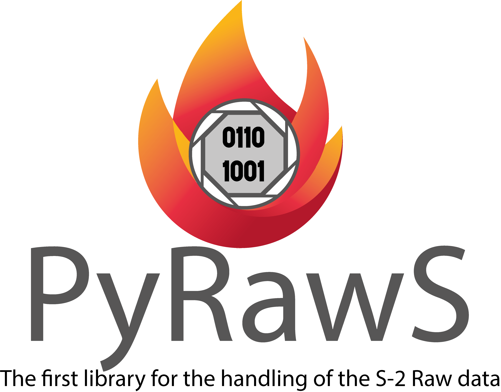
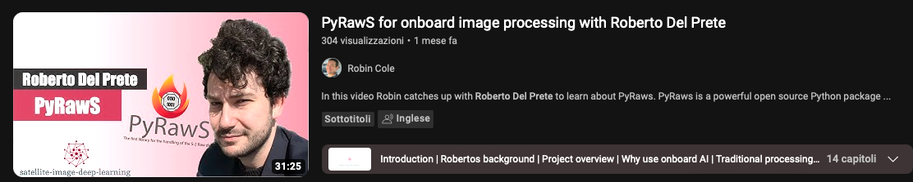

[](https://hub.docker.com/repository/docker/sirbastiano94/pyraws/general)


[](https://github.com/ESA-PhiLab/PyRawS/actions/workflows/run_tests.yml)


[](https://pypi.org/project/pyraws/)
[](https://esa-philab.github.io/PyRawS/)

*(Disclaimer: This project is currently under development.)*

# PyRawS
<p align="center">
  
</p>

## News & Updates

- [ ] [#23](https://github.com/ESA-PhiLab/PyRawS/issues/23)
- [x] [#28](https://github.com/ESA-PhiLab/PyRawS/issues/28)
- [ ] New Readme :tada: (23/03/2024)

## About the project
`Python for RAW Sentinel-2 data (PyRawS)` is a powerful open-source Python package that provides a comprehensive set of tools for working with [Sentinel-2 Raw data](#sentinel-2-raw-data)🔬.
<sup id="fnref:1"><a href="#fn:1" class="footnote">1</a></sup>
It provides utilities for coarse spatial bands coregistration, geo-referencing, data visualization📊, and image processing🖼️.
The software is demonstrated on the first Sentinel-2 🛰️ Raw database for warm temperature hotspots 🔥 detection/classification, making it an ideal tool for a wide range of applications in remote sensing and earth observation🌍.
The package is written in Python and is open source💻, making it easy to use and modify for your specific needs.
The systme is based on [pytorch]("https://pytorch.org/"), which be installed with `CUDA` support, to enable GPU acceleation.
The use of `PyRawS` and ideas behind [raw](#raw) data is described in our paper [G. Meoni, R. D. Prete, F. Serva, A. De Beusscher, O. Colin and N. Longépé, "Unlocking the Use of Raw Multispectral Earth Observation Imagery for Onboard Artificial Intelligence," in IEEE Journal of Selected Topics in Applied Earth Observations and Remote Sensing, vol. 17, pp. 12521-12537, 2024, doi: 10.1109/JSTARS.2024.3418891](https://ieeexplore.ieee.org/abstract/document/10571848).

> [!IMPORTANT]
> NB: What we call raw data in this project are Sentinel-2 data generated by the decompression and metadata addition of Sentinel-2 L0 data. Because of that, with the exception of the effects due to onboard equalization and lossy compression, they are the most similar version of the rawest form of data acquired by the satellite's sensors. Both the compression and equalization are applied onboard the satellite to reduce the amount of data transmitted to the ground station. For easy naming convention, this repo refer to the term "Raw" as the products decompressed with ancillary information appended. For further information browse our paper at https://arxiv.org/abs/2305.11891 <a href="#fnref:1" class="reversefootnote">&#8617;</a></li>

> [!NOTE]
> ### YouTube Tutorial ⭐️
>A demo showcasing PyRawS capabilities is available on the YouTube channel of [Robin Cole](https://www.youtube.com/watch?v=aLe7Pw3DVmo)
>


## Content of the repository
The PyRawS repository includes the following directories:

| Directory Name       | Description                                                                                                                                                                                     |
|----------------------|-------------------------------------------------------------------------------------------------------------------------------------------------------------------------------------------------|
| [quickstart](quickstart/README.md)           | Contains Jupyter notebooks for quick start:                                                                                                                                                     |
|                      |   1. API demonstration: Notebook demonstrating PyRawS API.                                                                                                                                      |
|                      |   2. DB_creation: Notebook for automatic creation of a database for a target dataset.                                                                                                           |
|                      |   3. geographical_distribution: Notebook to display the geographical distribution of dataset events on a map.                                                                                  |
| [pyraws](pyraws/)               | Contains PyRawS package with the following subdirectories:                                                                                                                                      |
|                      |   1. database: Various PyRawS and other databases.                                                                                                                                              |
|                      |   2. raw: Includes Raw_event and Raw_granule classes for modeling Sentinel-2 Raw events and granules.                                                                                         |
|                      |   3. l1: Contains L1_event and L1_tiles classes for modeling Sentinel-2 L1C events and tiles.                                                                                                  |
|                      |   4. utils: Utilities for the PYRAW package.                                                                                                                                                     |
| [resources](resources/)              | Contains various resources, such as images for the README.                                                                                                                                       |
| [scripts_and_studies](scripts_and_studies/) | Contains scripts and code for different studies related to the THRAWS dataset:                                                                                                                   |
|                      |   1. coregistration_study: Utils for coregistration study and coarse coregistration technique.                                                                                                  |
|                      |   2. dataset_preparation: Scripts and files for designing THRAWS files, including data download and event selection.                                                                          |
|                      |   3. hta_detection_algorithms: Custom and simplified implementation of various high-thermal-anomalies-detection algorithms, including those used for designing the THRAWS dataset.       |
|                      |   4. runscripts: Runscripts and utils for cropping Sentinel-2 L1C tiles, generating images, and exporting tif.                                                                                  |
|                      |   5. granules_filtering: Script for running and mapping cropped Sentinel-2 L1C tiles to corresponding Raw granules.                                                                           |
|                      |   6. download_thraws: Utility for downloading the THRAWS dataset from [Zenodo](https://zenodo.org/record/7908728).                                                                           |


## Installation

Install pyraws referring to the guide in [here](quickstart/INSTALLATION.md).


## Sidenote: Sentinel-2 Raw granules and events


Downloading [Sentinel-2 Raw data](#sentinel-2-raw-data) requires to specify a polygon surrounding the area of interest and a date. Given the pushbroom nature of the [Sentinel-2](https://sentinel.esa.int/documents/247904/685211/sentinel-2-products-specification-document) sensor, bands of data at  [Raw](#sentinel-2-raw-data) level do not look at the same area (i.e., they are not registered). Therefore,to be sure to collect all the band around an event (i.e., volcanic eruptions, wildfires) rectangular polygons centered on the events of area 28x10 $km^2$ are used (white rectangular in the image above). This leads to download all the [Raw granules](#sentinel-2-raw-granule) whose reference band (`B02`) interesects the polygon area. <br> The image above shows the footprint of the all the [Sentinel-2 Raw granules](#sentinel-2-raw-granule) that are downloaded for the eruption named "`Etna_00`" in our database by using the white rectangular polygon. We define the collection of [Raw granules](#sentinel-2-raw-granule) that are downloaded for each of the rows of our database "[Sentinel-2 Raw event](#Sentinel-2-RAW-event)". <br> However, as you can see in the image above, most of the [Sentinel-2 Raw granules](#sentinel-2-raw-granule) in `Etna_00` [Sentinel-2 Raw event](#Sentinel-2-RAW-event) do not contain the volcanic eruption (big red spot) of interest (red rectangulars). Indeed, only the yellow and the pink rectangulars intersects or include part of the volcanic eruption. <br> In addition, the fact that one [Raw granule](#sentinel-2-raw-granule) intersects or include one event, this does not mean that the latter interesects or is included in all the bands of that [Raw granule](#sentinel-2-raw-granule). In particular,
since we use the bands [`B8A`, `B11`, `B12`] to detect wildfires and volcanic eruptions, we consider [Raw useful granules](#raw-useful-granule) those granules whose band `B8A` interesects the event. This is true for the yellow rectangular but not for the pink one (you need to trust us here, since the bands are not displaced in the image above).  We take the band `B8A` only because after the coregistration, the other bands will be moved to match the area of `B8A`.<br>
Finally, for some [Raw useful granules](#raw-useful-granule) part of the eruptions or the wildfire could extend until the top or the bottom edge of the polygon. In this case, some of the bands could be missing for a portion of the area of interest. To be sure that this is not happening, in addition to the [Raw useful granules](#raw-useful-granule), it is important to consider [Raw complementary granules](#raw-complementary-granule), which fills the missing part of the interest bands of the [Raw useful granules](#raw-useful-granule). <br> For each [Sentinel-2 Raw event](#Sentinel-2-RAW-event), the `THRAWS` dataset clearly states those [Raw granules](#sentinel-2-raw-granule) that are [Raw useful granules](#raw-useful-granule) or [Raw complementary granules](#raw-complementary-granule). However, the entire [Raw granules](#sentinel-2-raw-granule) collection is provided for each [Raw event](#sentinel-2-raw-event) to permit users that wants to use other bands to detect warm temeprature anomalies to do it.

## Contributing
The ```PyRawS``` project is open to contributions. To discuss new ideas and applications, please, reach us via email (please, refer to [Contacts](#contacts)). To report a bug or request a new feature, please, open an [issue](https://github.com/ESA-PhiLab/PyRawS/issues) to report a bug or to request a new feature.

If you want to contribute, please proceed as follow:

1. Fork the Project
2. Create your Feature Branch (`git checkout -b feature/NewFeature`)
3. Commit your Changes (`git commit -m 'Create NewFeature'`)
4. Push to the Branch (`git push origin feature/NewFeature`)
5. Open a Pull Request

## License
Distributed under the Apache License.

## Contacts
Created by the European Space Agency $\Phi$-[lab](https://phi.esa.int/).

* Gabriele Meoni - gabriele.meoni@esa.int
* Roberto Del Prete - roberto.delprete at ext.esa.int and unina.it
* Nicolas Longepe - nicolas.longepe at esa.int
* Federico Serva - federico.serva at ext.esa.int

## Glossary
* ### Coarse coregistration
  Lightweight spatial coregistration method optimized for onboard-satellite applications. It simply shifts the various bands of a fixed factor that depends only on the bands, the satellite and detector number.

* ### Sentinel-2 L0 data
  Sentinel-2 data at `level-0` (`L0`) are data that are transmitted to Ground from Sentinel-2 satellites. The `L0` format is compressed to diminish downlink bandwidth requirements. For more information, refer to the [Sentinel-2 Products Specification Document](https://sentinel.esa.int/documents/247904/685211/sentinel-2-products-specification-document)

* ### Sentinel-2 Raw data
  In the frame of this project, the [Sentinel-2 Raw](#sentinel-2-raw-data) represents a particular product in the Sentinel-2 processing chain that matches a  decompressed version of [Sentinel-2 L0 data](sentinel-2-l0-data) with additional metadata that are produced on ground. Once decompressed, `Sentinel-2 Raw data` are the data available on Ground that better emulate the one produced by Sentinel-2 detectors with the exception of the effects due to compression and onboard equalization, which are not compensated at this stage. Therefore, `Sentinel-2 raw data` are those exploited in this project. For more information, refer to the [Sentinel-2 Products Specification Document](https://sentinel.esa.int/documents/247904/685211/sentinel-2-products-specification-document). <br>
**N.B**: the nomenclature ```raw data``` and its location in the Sentinel-2 processing chain is specific for this project only.

* ### Sentinel-2 Raw granule
    A `granule` is the image acquired by a Sentinel-2 detector during a single acquisition lasting 3.6 s. Granules are defined at [L0](#sentinel-2-raw-data) level. However, since the processing perfomed on the ground between L0 and raw data does not alter the image content (with the exception of the decompression process) but just provide additional metadata, granules are defined also at [Sentinel-2 Raw](#sentinel-2-raw-data) level.
    Given the pushbroom nature of the Sentinel-2 sensor, bands do not look at the same area at [Raw](#sentinel-2-raw-data) level. For more information, refer to the [Sentinel-2 Products Specification Document](https://sentinel.esa.int/documents/247904/685211/sentinel-2-products-specification-document)

* ### Sentinel-2 Raw event
   [Sentinel-2 Raw data](#sentinel-2-raw-data) are produced by decompressing [Sentinel-2 L0 data](sentinel-2-raw-data). To download L0 data,  it is necessary to specify one polygon that surrounds a particular area-of-interest. This leads to download all those [Sentinel-2 Raw granules](#sentinel-2-raw-granule) whose reference band intersects the specified polygon. Such collection is a `Raw-event`. Each `Raw-event` matches one of the `ID_event` entry of the database. <br>
    For each `Raw-event`, we do not provide all the collection of  [Sentinel-2 Raw granules](#sentinel-2-Raw-granule), but only the set of [Raw data useful granules](#raw-data-useful-granule) and [Raw data complementary granules](#Raw-data-complementary-granule). For an intuitive example, please, check [Raw events and granules](#raw-events-and-raw-granules).

* ### Sentinel-2 L1C data
  The `Level 1-C` (`L1C`) is one format for `Sentinel-2` data. To convert [Sentinel-2 Raw data](#sentinel-2-raw-data) to `L1C` data, numerous processing steps are applied to correct defects, including bands coregistration, ortho-rectification, decompression, noise-suppression and other. For more information, refer to the [Sentinel-2 Products Specification Document](https://sentinel.esa.int/documents/247904/685211/sentinel-2-products-specification-document).

* ### Sentinel-2 L1C event
  Same concept for [Sentinel-2 Raw events](#sentinel-2-raw-event) but applied on [Sentinel-2 L1C data](#sentinel-2-l1c-data).

* ### Sentinel-2 L1C tile
  The `Sentinel-2 L1C tile` is the minimum `L1C` product that can be downloaded.

* ### Raw complementary granule
  Given a certain set of bands of interest `[Bx,By,...,Bz]`, `Raw complementarey granules` are the granules adjacents at [Raw-useful-granules](#raw-useful-granule) that that can be used to fill missing pixels of `[By,...,Bz]` bands due to their coregistration with respecto the band `Bx`. For an intuitive example, please, check [Raw events and granules](#raw-events-and-raw-granules).

* ### Raw useful granule
  Given a certain set of bands of interest `[Bx,By,...,Bz]`, where `Bx` is the first band in the set, an `Raw useful granule` is one of the collection of [Sentinel-2 Raw granules](#sentinel-2-raw-granule) that compose a [Sentinel-2 Raw event](#sentinel-2-raw-event) whose band `Bx` include (or intersects) a certain area of interest (e.g., an eruption or an area covered by a fire). For an intuitive example, please, check [Raw data events and granules](#raw-events-and-raw-granules).
