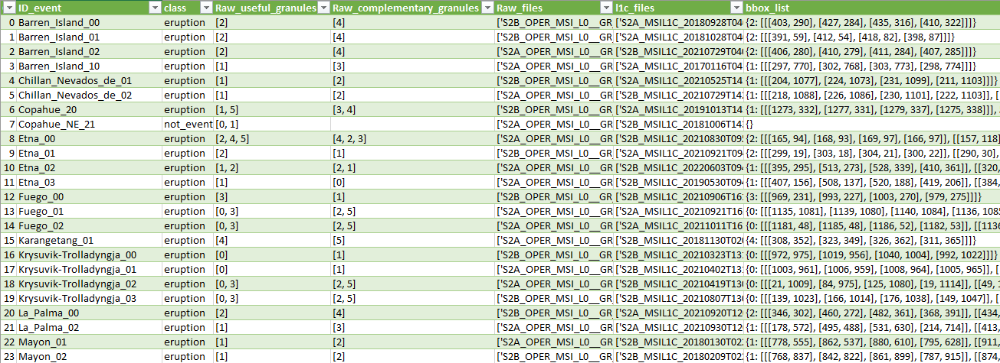

.. _database:

Database
===============

**Table of contents**

.. contents::
   :local:
   :depth: 1


The database module of PyRawS contains the essential data repositories required for Sentinel-2 raw data processing. Two important files are located in this module:

- `shift_lut.csv`: Stores the predetermined offsets for adjusting the bands of Sentinel-2 raw data.
- `thraws_db.csv`: Serves as the main database file, containing necessary information for raw data processing.

Working with THRAWS
-------------------

The creation of your custom database, "THRAWS", is facilitated by a Jupyter notebook, namely `database_creation.ipynb`, included in this repository. The notebook provides a comprehensive set of instructions and the corresponding code for establishing the database. Follow these instructions diligently to ensure the accurate and error-free creation of the "THRAWS" database. Please ensure that all the required packages and dependencies are installed in your environment prior to running the notebook.


The included `THRAWS` database is a representative example, illustrating how PyRawS organizes and processes Sentinel-2 Raw and L1 data. The database features several essential fields:

- **ID_event**: Identification for each event (e.g., volcanic eruption, wildfire, not-event). The remaining fields in the row correspond to this particular Sentinel-2 acquisition.
- **class**: Event class (e.g., eruption, fire, not-event). If not known, leave it empty.
- **Raw_useful_granules**: List of Raw useful granules. Set to `None` or leave it empty if unknown.
- **Raw_complementary_granules**: List of Raw complementary granules. Set to `None` or leave it empty if unknown.
- **Raw_files**: List of Raw granules (mandatory).
- **l1c_files**: List of L1 tiles (mandatory if L1C data are required).
- **bbox_list**: Dictionary consisting of Raw useful granules and corresponding bounding box lists. Set to `None` or leave it empty if the bounding box location is unknown.




....


Working with custom databases
-----------------------------

To create a custom database, please proceed as follows:

1. Generate a ".csv" file mimicking the structure mentioned above and save it in the `database` subfolder (e.g., `my_db.csv`). You may start from the [thraws_db.csv](https://github.com/ESA-PhiLab/PyRawS/-/blob/main/PyRawS/database/thraws_db.csv) database and modify it according to your requirements.
2. Create a subdirectory named `my_database_name` under the `data` directory and populate it with corresponding Sentinel-2 Raw data and Sentinel-2 L1 data as described in the Data directory.
3. Update the `DATABASE_FILE_DICTIONARY` in `PyRawS/utils/constants.py`:

   ```python
   DATABASE_FILE_DICTIONARY={"THRAWS" : "thraws_db.csv", "my_database_name" : "my_db.csv"}
   ```

You can now utilize your custom database! Please note, although creating a database is not mandatory, it is highly recommended. Without a database, while you can open Raw data as described in Open a Raw event from path, you cannot retrieve some essential information, such as Raw useful granules for a specific event, event bounding boxes, or image class.

.. automodule:: pyraws.database
   :members: